# Concierge — build log

Stage-by-stage record of the build in [`dev-plan.md`](dev-plan.md). Each stage ends with checks anyone can rerun. After each stage the build stops; the next one starts only when Cuneyt or Oskar confirms.

**What each stage should look like:** [`stage-screens.md`](stage-screens.md) (ASCII sketches).

**How to follow along:** `git log --oneline` shows one commit per stage (`build(sN): …`). Each stage below lists the files changed, how to check it, and what we saw.

## Stages

| Stage | Dev-plan milestone | Goal | Status |
|---|---|---|---|
| S1 | M0 P1 | Next.js + CopilotKit runtime + chat popup answers "hi" | done (68c8b7c) |
| S2 | M0 both | `lib/contracts.ts`: tool result types + fixture data | review (Oskar) |
| S3 | M0 P2 | Seed Ambiguous: demo company Wiki pages, sales channel (writes to the real workspace) | done |
| S4 | M1 P1 | Ambiguous client + `search_knowledge`, `create_lead`, `notify_team` + smoke script | done |
| S5 | M1 P2 | Acme website sections + `SourceCard`, `LeadCard` → checkpoint: Flow A without booking | done |
| S6 | M2 | Booking: `get_slots`, `choose_slot` (SlotPicker), `book_meeting` (BookedCard) | done |
| S7 | M2 | Flow E: `capture_email` (EmailCapture), `log_gap` (GapCard) | done |
| S8 | M2 | Flow B playbook via `useAgentContext` + X1 `highlight_plan` → feature freeze | done (freeze check moves to S9, after the reset script) |
| S9 | M3 | `scripts/reset-demo.ts` + split-screen setup | todo |
| S10 | M4 | Rehearse twice, backup video | todo |

---

## S1 — scaffold + chat reply

**Goal:** the Next.js app runs on `localhost:3000`, the CopilotKit runtime lists the `default` agent, and the popup streams a Claude reply to "hi".

**Files**

| File | What |
|---|---|
| `package.json`, `package-lock.json` | Next.js 16.3.5, React 19.2.8, Tailwind 4, `@copilotkit/react-core@1.71.1`, `@copilotkit/runtime@1.71.1`, `zod@3` |
| `tsconfig.json`, `next.config.ts`, `eslint.config.mjs`, `postcss.config.mjs`, `public/` | `create-next-app` defaults (scaffolded in a temp folder, moved in) |
| `AGENTS.md`, `CLAUDE.md` | Written by `create-next-app`: tells coding agents to read `node_modules/next/dist/docs/` because Next 16 differs from their training data |
| `.gitignore` | Merged ours with Next's; also ignores `.idea/` |
| `app/api/copilotkit/[[...slug]]/route.ts` | Copilot Runtime with one agent named `default` |
| `lib/agent.ts` | `BuiltInAgent`, `maxSteps: 8`, placeholder prompt. Model from `CONCIERGE_MODEL`, default `anthropic:claude-sonnet-5` |
| `app/layout.tsx` | `CopilotKitProvider` + CopilotKit v2 styles |
| `app/page.tsx` | Placeholder page (real Acme site in S5) |
| `components/concierge/ConciergeWidget.tsx` | `CopilotPopup` |

**Check it**

```bash
npm install                                   # ~16 min on first run (1,592 packages)
npm run dev                                   # port 3000; if taken: npx next dev -p 3100
curl -s localhost:3000/api/copilotkit/info    # lists "default"
npx tsc --noEmit && npm run lint              # both clean
# open http://localhost:3000, click the chat bubble, type "hi"
```

**Result (2026-09-12, Cuneyt's machine, port 3100 because another app holds 3000)**

| Check | Seen |
|---|---|
| `GET /api/copilotkit/info` | `200`, `"agents":{"default":{"className":"BuiltInAgent", …}}`, version `1.71.1` |
| Chat "hi" | `POST /api/copilotkit/agent/default/run 200 in 1559ms`; reply "Hi there! Welcome to Acme — how can I help you today?" |
| Model | `anthropic:claude-sonnet-5` accepted by the bundled `@ai-sdk/anthropic`; no fallback needed |
| `tsc --noEmit`, `eslint` | Clean |

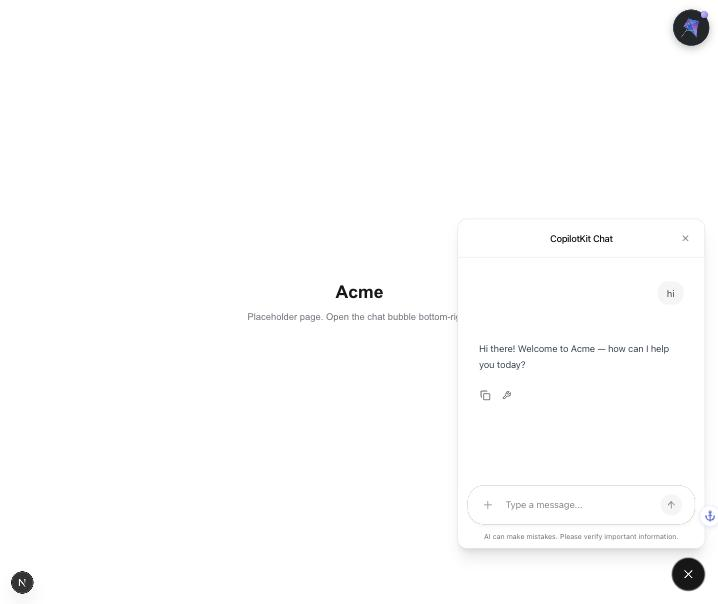

**Notes for later stages**

- The dev log prints an AI SDK warning about system messages in `messages`. It comes from CopilotKit's `BuiltInAgent` and is harmless.
- CopilotKit runtime telemetry is on by default. To turn it off, add `COPILOTKIT_TELEMETRY_DISABLED=true` to `.env.local`.
- Use `localhost`, not `127.0.0.1`: Next 16 blocks dev resources (HMR) from other origins unless they're listed in `allowedDevOrigins`.
- The `BuiltInAgent` instance lives at module scope, so it handles one run at a time. That's fine for a single-visitor demo (`copilotkit-context.md` gotcha 3).

---

## S2 — tool contracts

**Goal:** one file both tracks build against. Track A implements tools that return these shapes; Track B builds cards from `FIXTURES` without waiting for Ambiguous.

**Files**

| File | What |
|---|---|
| `lib/contracts.ts` | `TOOL` names, Zod parameter schemas (used by server tools and browser hooks alike), result types, `FIXTURES` |
| `docs/concierge/dev-plan.md` | Contract table synced; now points to `lib/contracts.ts` as source of truth |

**Changes vs. the dev-plan table** (driven by the sketches in `stage-screens.md` and the Ambiguous API spec)

| Tool | Change | Why |
|---|---|---|
| `search_knowledge` | Result hit gets optional `content` | Wiki search returns a ~65-character `snippet`: too short to answer from. The tool will also fetch page text for the model; cards ignore it |
| `create_lead` | Result gets `need` | LeadCard shows "needs SAP" |
| `book_meeting` | Params: `contactName` and `email` now required | `POST /api/public/scheduler/…/book` requires `guest_name` and `guest_email` |
| `log_gap` | Result gets `question`, `email?` | GapCard shows the question and where the answer goes |

**Findings from the Ambiguous API (read-only, Concierge key)**

| Endpoint | Finding |
|---|---|
| `GET /api/wiki/search?q=` | `200`; hits have `id`, `title`, `slug`, `snippet`, `space_id` |
| `GET /api/channels` | Only `general` (public) and Concierge's DM. **No `#sales` yet** |
| `GET /api/crm/deals` | `0` deals |
| `GET /api/crm/scheduler-links` | `0` links. `POST` exists (title, duration, `member_user_ids`, `auto_create_contact`), and public `…/slots?date=` + `…/book` exist → **S6 can book for real**; no need for the Task fallback unless it fails in testing |

**Check it**

```bash
npx tsc --noEmit && npm run lint   # clean
```

**Result:** `tsc` and `eslint` clean. Awaiting Oskar's review of names and shapes before S5 builds on them.

---

## S4 — server tools + smoke script

**Goal:** the agent can read the Wiki and write to the CRM and Chat. Each tool is testable from a terminal, without the chat.

**Files**

| File | What |
|---|---|
| `lib/ambiguous.ts` | `ambi()` fetch helper: Bearer `AMBI_API_TOKEN`, `API-Version: 1`, retries 429 honoring `Retry-After`, errors include status + first 300 chars. `docToText()` flattens Wiki editor JSON to text |
| `lib/tools/search-knowledge.ts` | `GET /api/wiki/search?q=&space=acme&limit=3`; if 0 hits, retries word by word; fetches each page (`GET /api/wiki/pages/{id}`) for `content` (≤2,000 chars). Link: `…/wiki/{space}/{page-slug}` |
| `lib/tools/create-lead.ts` | `POST /api/crm/contacts` (company), `POST /api/crm/contacts` (person, linked), `POST /api/crm/deals` (open, linked, pipeline **Sales** / first stage; 409 → reuse existing deal). Deal title: `Northline Freight: 200 seats, live by Q4, SAP integration` |
| `lib/tools/notify-team.ts` | Finds the `sales` channel via `GET /api/channels`, posts `🔥 Hot lead` + summary + deal link |
| `lib/agent.ts` | Prompt: knowledge + qualifying rules; registers the 3 tools |
| `scripts/smoke-tools.ts`, `package.json` (`npm run smoke`, `tsx`) | Read-only by default; `--write` also runs `create_lead` + `notify_team` with `[SMOKE]` names |

**Settings (optional, `.env.local`)**

| Variable | Default | Use |
|---|---|---|
| `CONCIERGE_WIKI_SPACE` | `acme` | The only Wiki space visitors can see. Internal pages (playbook) stay in `home` |
| `CONCIERGE_SALES_CHANNEL` | `sales` | Channel for hot-lead alerts |
| `CONCIERGE_PIPELINE` | `Sales` | CRM pipeline for new deals (first stage) |
| `CONCIERGE_COMPANY` | `Acme` | Company name in the prompt |

**Check it**

```bash
npm run smoke              # read-only
npm run smoke -- --write   # creates [SMOKE] company, contact, deal + one #sales message
```

**Result so far (2026-09-12)**

| Check | Seen |
|---|---|
| `npm run smoke` (read-only) | `search_knowledge "SAP"` **FAIL: 0 results**, expected: the `Acme` space doesn't exist yet (S3). `"on-prem"` ok, 0 results |
| Search against `home` space, query "how AI coworkers work" | Phrase search 0 → word fallback → 3 pages with text content; link `https://app.ambiguous.ai/wiki/home/welcome` matches the browser URL |
| Chat runtime, "Do you integrate with SAP?" (`POST /api/copilotkit/agent/default/run`) | `TOOL_CALL_START search_knowledge {"query":"SAP integration"}` → `{"results":[]}` → reply: "I don't have that info handy, so I'll check with the team and follow up. In the meantime, are you exploring Acme for your company?" |
| `tsc --noEmit`, `eslint` | Clean |

**Write test (2026-09-12, after Cuneyt created `#sales`)**

| Check | Seen |
|---|---|
| `npm run smoke -- --write`, 1st run | `create_lead ok`, `notify_team ok`, but the deal was **invisible on the CRM board** ("No pipelines configured") and Concierge's key got `404` reading its own deal |
| Fix: pipeline | Created CRM pipeline **Sales** (API, Concierge key): New lead → Meeting booked → Proposal → Won / Lost. `PATCH` of `pipeline_id` on an existing deal is silently ignored, so `create_lead` now sets `pipeline_id` + first `stage_id` at creation |
| Fix: reruns | Ambiguous answers `409 {"error":"Deal already exists","deal_id":…}` for a duplicate title; `create_lead` now reuses that `deal_id` |
| Cleanup | Deleted all test CRM records (1 deal outside any pipeline, 3 `[SMOKE]` companies, 3 "Jane Doe" contacts) with Cuneyt's owner session: `204` each, CRM back to 0/0 |
| `npm run smoke -- --write`, final run | `create_lead ok` → deal in **Sales / New lead** on the board; `notify_team ok` → "🔥 Hot lead" message from Concierge (AI) in `#sales` |
| Deal link | `/crm/deals/{id}` opens the CRM overview; the app's real link is **`/crm/pipeline?deal={id}`** (now used) |

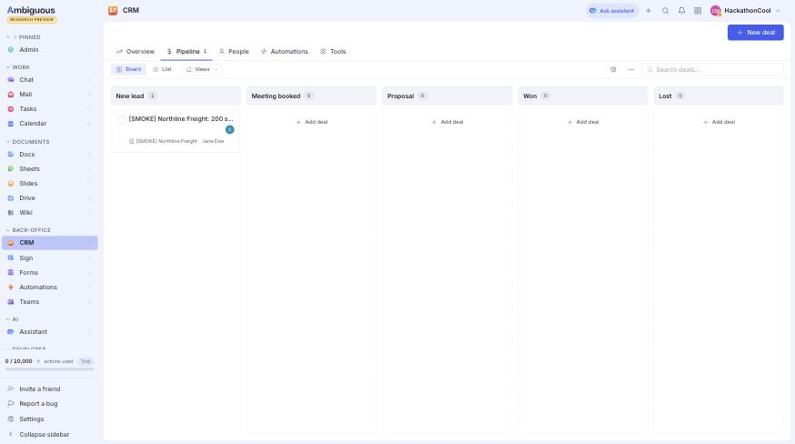


**Left in the workspace on purpose:** 1 `[SMOKE]` company, contact and deal (Sales / New lead) and 2 `[SMOKE]` messages in `#sales`. S9's reset removes them.

**S4 done** once S3 landed: `npm run smoke` → `all checks passed` (see S3).

**Notes**

- Web app routes seen: `/wiki/{space-slug}/{page-slug}`, `/crm/pipeline?deal={id}`, `/chat/{channel-id}`, `/tasks`.
- **Concierge can create deals but can't read them** (`GET /api/crm/deals` → 0, `GET /api/crm/deals/{id}` → 404, while the owner sees them, `owner_id` = Concierge). S6's "move deal to Meeting booked" may need another route; test it there.
- The workspace (`HackathonCool`) shows `0 / 10,000 actions used · Trial`, not the Free plan's 1,000 from `ambiguous-context.md`.
- **Env gotcha (hit on Cuneyt's terminal):** an empty variable already in the shell beats `.env.local`, both for `tsx --env-file` and for Next.js. oh-my-zsh's dotenv plugin sources `.env` on `cd`, and a `.env` copied from `.env.example` exports `AMBI_API_TOKEN=` and `ANTHROPIC_API_KEY=` empty. Symptom: `AMBI_API_TOKEN is empty`. Fix: keep secrets only in `.env.local`, no `.env`; in an open terminal run `unset AMBI_API_TOKEN ANTHROPIC_API_KEY AMBI_API_URL`.
- Chat-created records carry no prefix (the audience sees them). S9's reset must find them another way (e.g. created by the Concierge agent), not by a `[DEMO]` title prefix.

---

## S3 — Wiki content + sales channel

**Goal:** Acme's knowledge lives in Ambiguous, so the agent answers from it; one deliberate gap (on-prem) for Flow E; a playbook page for Flow B.

Done by Claude through the API with Cuneyt's CLI session (pages show Cuneyt as author); `#sales` created by Cuneyt in the app.

**Created in Ambiguous**

| What | Where | Source in repo |
|---|---|---|
| Space **Acme** (`acme`, visibility workspace) | Wiki | — |
| Product, Integrations, Pricing, FAQ | Wiki → Acme | `scripts/seed/{product,integrations,pricing,faq}.md` |
| Concierge playbook (Tone: formal, Offer: none, 3 rules) | Wiki → **Home** (internal, not searchable by visitors) | `scripts/seed/concierge-playbook.md` |
| `#sales` (public, 3 members) | Chat | — |
| Pipeline **Sales** (New lead → Meeting booked → Proposal → Won / Lost) | CRM | created during S4 |

**Content rules the demo depends on**

- Integrations says "SAP S/4HANA" (Flow A). Pricing says Growth is the best fit for 25–500 seats (X1: 200 seats → Growth).
- No page mentions on-prem, self-hosting, cloud, deploy, install or servers (checked with `grep`), so "Do you offer on-prem?" stays a real gap (Flow E). Mentioning "cloud" would let the agent infer an answer.
- The playbook sits in `home`, outside the searchable `acme` space: a visitor asking about discounts can't get the internal rules as a source.

**Check it**

```bash
npm run smoke    # all checks passed
```

**Result (2026-09-12)**

| Check | Seen |
|---|---|
| `npm run smoke` | `search_knowledge "SAP" ok 2 result(s): Pricing, Integrations`; `"on-prem" ok 0 results`; **all checks passed** |
| Visitor search for "discount" in `acme` | `[]`: playbook not exposed |
| Concierge `GET /api/wiki/pages/{playbook}` | `200`: readable for S8 |
| Chat: "Do you integrate with SAP?" | `search_knowledge {"query":"SAP integration"}` → Pricing, Integrations → "Yes — Acme has a two-way SAP S/4HANA integration (syncing work orders, parts, and maintenance costs with SAP Plant Maintenance and Finance), typically set up in about a day. It's available on our Growth and Enterprise plans. Are you exploring this for your company currently?" |
| Chat: "Do you offer on-prem?" | `search_knowledge {"query":"on-prem deployment"}` → `[]` → "We don't currently have on-prem details confirmed—I'll check with the team and get back to you." |

---

## S5 — Acme website + SourceCard, LeadCard

**Goal (checkpoint):** Flow A without booking, in a real browser. "Do you integrate with SAP?" shows a source card; qualifying answers show a lead card, and the deal plus the alert appear in Ambiguous.

Built by Claude (planned for Track B).

**Files**

| File | What |
|---|---|
| `app/globals.css`, `app/layout.tsx` | Acme brand tokens (asphalt ink, concrete ground, safety orange), Barlow / Barlow Condensed / Geist Mono; single light look; CopilotKit Inspector off (`enableInspector={false}`) for a clean stage |
| `app/page.tsx`, `components/site/{Nav,Hero,Integrations,Pricing,Faq}.tsx` | Site with anchors `#product`, `#integrations`, `#pricing`, `#faq`. Pricing cards have `id="plan-{starter,growth,enterprise}"` + `data-plan` for X1. Numbers match the Wiki; FAQ has no hosting question |
| `components/concierge/ConciergeWidget.tsx` | `CopilotPopup` (labels: "Acme assistant", welcome text) + `useRenderTool` for `search_knowledge` and `create_lead`. `notify_team` intentionally has no card |
| `components/concierge/cards/{SourceCard,LeadCard,parse}.tsx` | Cards with loading states ("Searching Acme knowledge base for “SAP”…", "Passing Northline Freight to the sales team…"); tool results arrive as JSON strings |
| `lib/tools/search-knowledge.ts` | Card snippet = the page line containing the query word (search snippets were cut mid-word); for a FAQ question line, the answer below it |
| `lib/agent.ts` | Qualifying now asks for **email** too (5 facts), since S6 booking requires it |

**Check it**

Open http://localhost:3000 (Cuneyt: 3100), then type:
1. `Do you integrate with SAP?`
2. `I'm Jane Doe from Northline Freight. We'd need about 200 seats, live by Q4.`
3. `jane@northline.example` (if asked)

**Result (2026-09-12, headless Chrome)**

| Step | Seen |
|---|---|
| 1 | SourceCard: "Integrations ↗ SAP S/4HANA: two-way sync of work orders, parts and maintenance costs…", "Pricing ↗ SAP S/4HANA and Salesforce integrations". Reply: "Yes — Acme has a native SAP S/4HANA connector (two-way sync of work orders, parts, and maintenance costs), available on Growth and Enterprise plans, typically set up in about a day." |
| 2 | "I have everything except your email—could you share that so I can set up the deal?" |
| 3 | LeadCard "✓ Sales team has your details · NORTHLINE FREIGHT · Seats 200 · Live by Q4 · Needs SAP integration" |
| Ambiguous CRM | Deal `Northline Freight: 200 seats, live by Q4, SAP integration` in Sales / New lead (22:31:22 UTC) |
| Ambiguous `#sales` | "🔥 Hot lead / Northline Freight (Jane Doe) - 200 seats, needs SAP integration. / Timeline: live by Q4. / …/crm/pipeline?deal=41869e0e…" (22:31:26 UTC) |
| `tsc`, `eslint` | Clean |

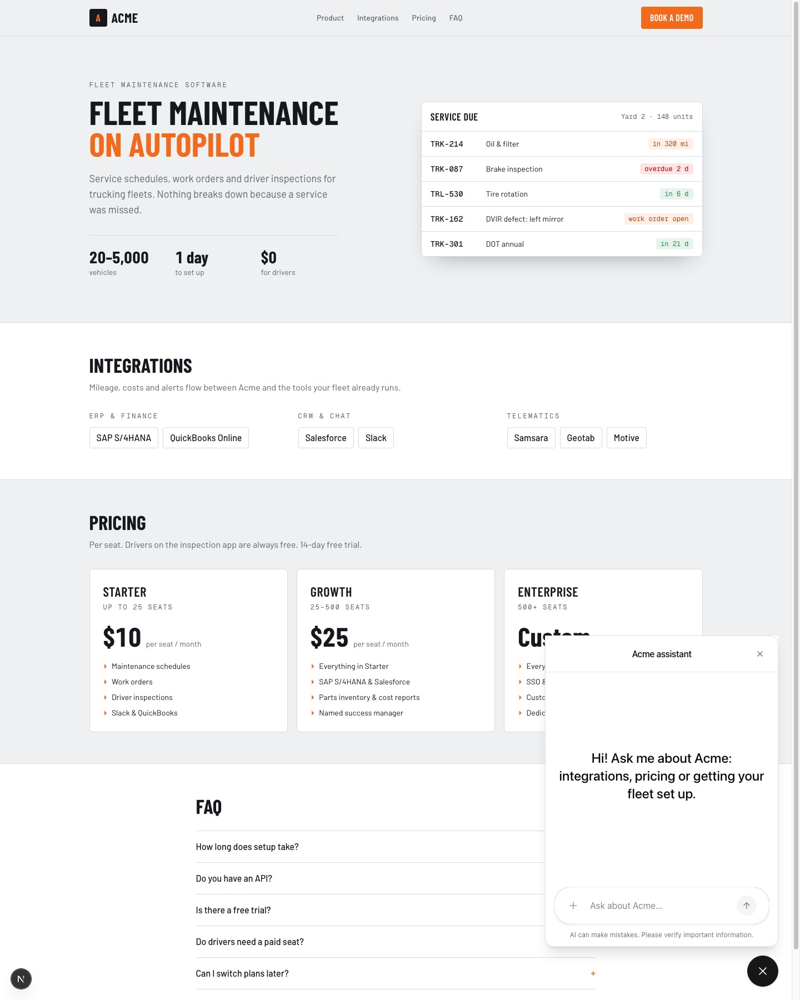


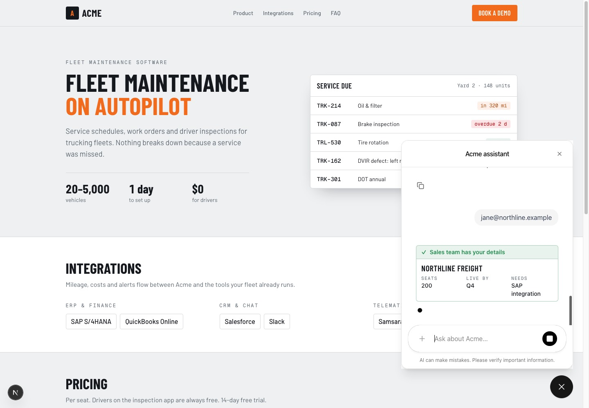

**Notes**

- **Browser automation:** the Claude-in-Chrome extension in Dia timed out ("page is busy") on this page even though the renderer used ~10% CPU and headless Chrome rendered it instantly. The checks above therefore ran in headless Google Chrome driven over the DevTools protocol. A human in Dia sees the page normally.
- The popup opens by default on page load.
- A real `Northline Freight` deal now exists. A rerun reuses it (409 handling from S4), but `create_lead` still adds a new company and contact each time. Run S9's reset before the demo.

---

## S6 — booking (end of Flow A)

**Goal:** the visitor picks a time in the chat, the call is booked in Ambiguous, the deal moves to *Meeting booked*, and sales gets an alert with the meeting time.

**Set up in Ambiguous (API, Cuneyt's session)**

| What | Details |
|---|---|
| CRM scheduler link **Acme demo call** | id `34e3cbf3…`, owner Cuneyt, slug `acme-demo`, 30 min, 60 min notice, 14 days ahead, `auto_create_contact: false`. Public path `/api/public/scheduler/hackathoncool/cuneyt.mertayak/acme-demo` (no auth needed) |
| Business hours | `{"mon".."fri": ["16:00","24:00"]}`. **Quirk:** Ambiguous applies these hours in UTC and ignores the link's `America/Los_Angeles` timezone (a test booking at "09:00" became a 09:00 UTC = 2 AM PT calendar event; cancelled). 16:00–24:00 UTC = 9:00 AM–5:00 PM PDT. Revisit if the demo runs after DST ends (Nov 1) |

**Files**

| File | What |
|---|---|
| `lib/tools/scheduler.ts` | Link path (`CONCIERGE_SCHEDULER_LINK`), timezone (`CONCIERGE_TIMEZONE`, default `America/Los_Angeles`), slot labels |
| `lib/tools/slots.ts` | `get_slots`: next 3 business days, first free slot from 10:00 and from 14:00 local → up to 6 slots |
| `lib/tools/book-meeting.ts` | `book_meeting`: `POST …/book`; then moves the deal to *Meeting booked* (best effort). If booking fails → **Task fallback** for the sales rep (`via: "task"`, untested) |
| `lib/contracts.ts` | `bookMeetingParams` gets optional `dealId` |
| `lib/agent.ts` | Meetings rule: after `create_lead` offer a call → `get_slots` → `choose_slot` → `book_meeting` → `notify_team` with the meeting time; declined → `notify_team` right away |
| `components/concierge/cards/{SlotPicker,BookedCard}.tsx`, `ConciergeWidget.tsx` | `choose_slot` via `useHumanInTheLoop` (agent pauses until a click; "None of these work" → declined); `book_meeting` via `useRenderTool`; "Finding times…" while `get_slots` runs |
| `scripts/smoke-tools.ts` | Read-only `get_slots` check |

**Findings**

- Concierge's key **can** move a deal between stages (`PATCH /api/crm/deals/{id}`); the S4 read problem only affected the deal without a pipeline.
- Concierge can't list the owner's scheduler links (`GET /api/crm/scheduler-links` → 0), so the link path is configured, not discovered.
- `create_lead` requires `need`; if the visitor never mentions one, the agent asks for it (one extra turn). Flow A's SAP question covers it.

**Check it**

```bash
npm run smoke   # includes get_slots
```
Chat: `I'm <name> from <new company>, <email>. About 60 seats, live in October. Can I talk to someone?` → answer the need question → click a time.

**Result (2026-09-12, headless Chrome)**

| Run | Seen |
|---|---|
| `npm run smoke` | `get_slots ok 6 slot(s): Mon, Sep 14, 10:00 AM \| … \| Wed, Sep 16, 2:30 PM`; all checks passed |
| Maria Chen, Cascade Haulers (SAP question → details → "Yes, let's set up a call." → click Tue 10:00 AM) | LeadCard → SlotPicker → "Picked Tue, Sep 15, 10:00 AM". Ambiguous: booking **confirmed** 2026-09-15T17:00Z; deal → **Meeting booked**; `#sales`: "🔥 Hot lead / Cascade Haulers (Maria Chen) — 120 seats, live by November, needs SAP integration. / Meeting booked Tue, Sep 15, 10:00 AM–10:30 AM." |
| Priya Nair, Summit Freightways (details + "Can I talk to someone?" → need → click Wed 2:00 PM) | SlotPicker (Tue shows 10:30 AM: 10:00 is taken by Maria) → BookedCard "✓ Call booked · WED, SEP 16, 2:00 PM–2:30 PM". Deal → Meeting booked; `#sales` alert includes the meeting time |

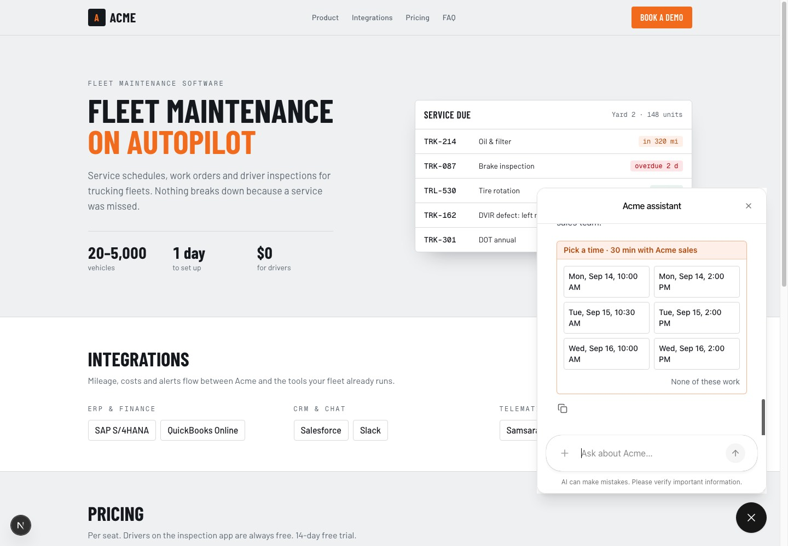

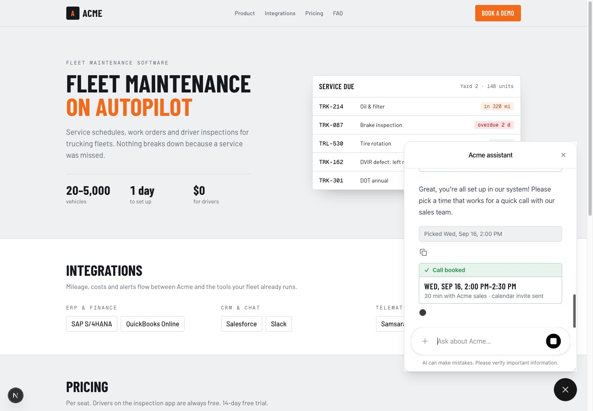

**Demo data now in the workspace:** deals Northline Freight, Cascade Haulers, Summit Freightways (+ `[SMOKE]`); bookings on Cuneyt's calendar Tue Sep 15 10:00 AM (Maria) and Wed Sep 16 2:00 PM (Priya); their `#sales` alerts. S9's reset must cancel bookings too.

---

## S7 — knowledge gap (Flow E)

**Goal:** a question the Wiki can't answer becomes a task for the team (plus a chat heads-up); once someone writes the page, the next visitor gets the answer with a source.

**Set up in Ambiguous**

| What | Why |
|---|---|
| Tasks project **Website questions** (visibility workspace, created with Cuneyt's session) | Tasks outside a project are visible only to their creator (Concierge) and assignee: Cuneyt's login got `404` on the gap task, and subscribers don't get access either. In a workspace project, everyone (including the presenter's screen) sees it |

**Files**

| File | What |
|---|---|
| `lib/tools/log-gap.ts` | `POST /api/tasks` "FAQ gap: \"…\"" assigned to **Oskar** (`CONCIERGE_GAP_ASSIGNEE_ID`), project **Website questions** (`CONCIERGE_GAP_PROJECT`), description with the visitor's email; then a one-line heads-up in `#sales` (`CONCIERGE_GAP_CHANNEL`, default `sales`; a failed post doesn't lose the task). Link: `/tasks?project={id}` (opening a task doesn't change the URL) |
| `lib/tools/channels.ts`, `lib/tools/notify-team.ts` | Shared `postToChannel(name, content)` |
| `lib/tools/search-knowledge.ts` | Fallback also tries hyphen parts and 4-letter stems: "on-premise" / "on-premises deployment" now find a page titled "On-prem" |
| `lib/agent.ts` | Gap rule: never guess → say you'll check → `capture_email` (skip if email known) → `log_gap` |
| `components/concierge/cards/{EmailCapture,GapCard}.tsx`, `ConciergeWidget.tsx` | `capture_email` via `useHumanInTheLoop` (email field + Send/Skip; agent pauses); `log_gap` via `useRenderTool` |
| `scripts/seed/on-prem.md` | The page text Oskar pastes live on stage (Wiki → Acme → new page "On-prem") |

**Check it**

1. Chat: `Do you offer on-prem?` → type an email → **Send**.
2. Ambiguous: **Tasks → Projects → Website questions** (or `/tasks?project=…`) shows the task assigned to Oskar; **Chat → #sales** shows "❓ Website question with no Wiki answer…".
3. Write Wiki → Acme → page **On-prem** (text in `scripts/seed/on-prem.md`), open a fresh chat, ask again → answer with an "On-prem ↗" source.
4. Delete the On-prem page again before the demo (S9 automates this).

**Result (2026-09-12, headless Chrome)**

| Step | Seen |
|---|---|
| Ask | `search_knowledge` → 0 → "We don't have that documented, so let me check with the team on this one — could you share your email so we can follow up?" + EmailCapture card |
| Send `jane@northline.example` | "We'll reply to jane@northline.example" → GapCard "✓ Sent to the Acme team · “Do you offer on-prem deployment?” · The answer goes to jane@northline.example" |
| Ambiguous | Task `FAQ gap: "Do you offer on-prem deployment?"` (assignee Oskar, project Website questions, visible to Cuneyt); `#sales`: "❓ Website question with no Wiki answer: \"Do you offer on-prem deployment?\" / Task created for the team: …" |
| On-prem page created, ask again (1st try) | Still "we don't have that documented": the model searched a variant ("on-premise…") that doesn't prefix-match "on-prem" → stem fallback added |
| Ask again (after fix) | SourceCard "On-prem ↗ Yes. Acme offers an on-prem edition on the Enterprise plan…" → "Yes—Acme has an on-prem edition on our Enterprise plan, running on your own Linux servers via Docker…" |
| Page deleted (moved to trash) | "on-prem", "on-premise", "on-premises deployment", "self-hosted" → 0 results each; `npm run smoke` all checks passed |

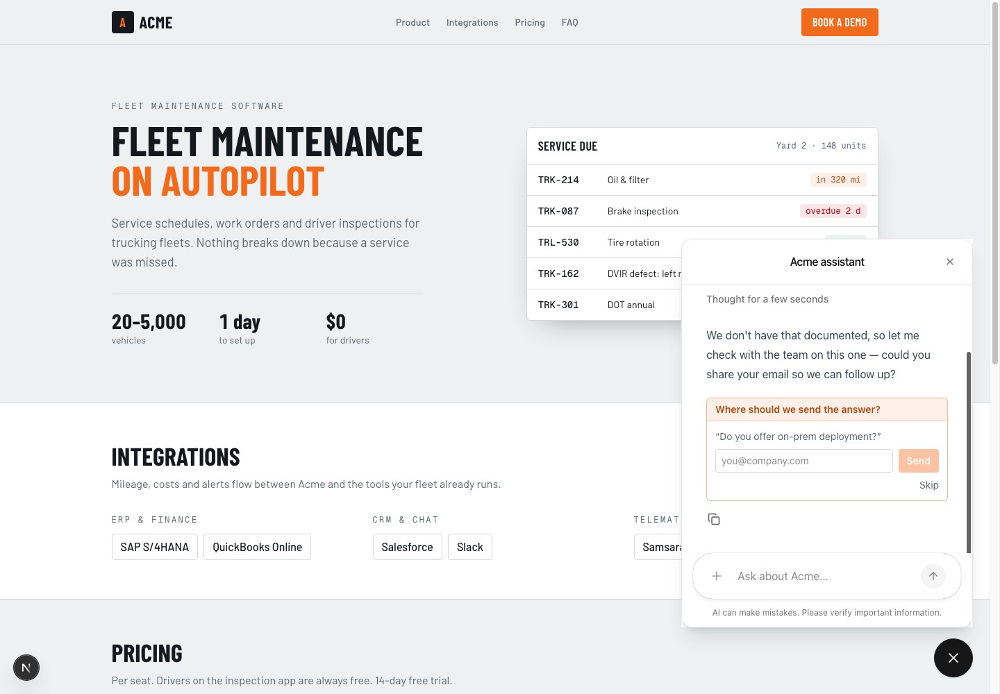

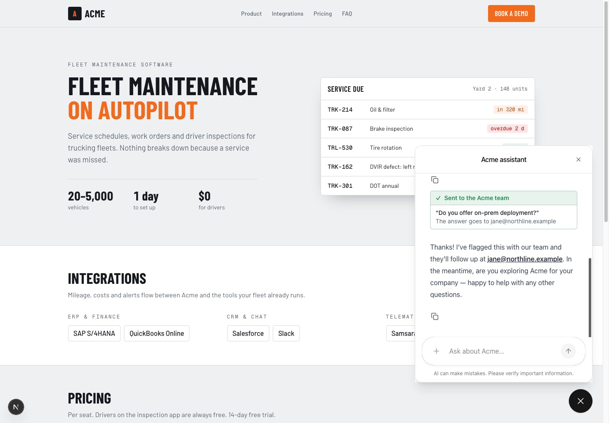

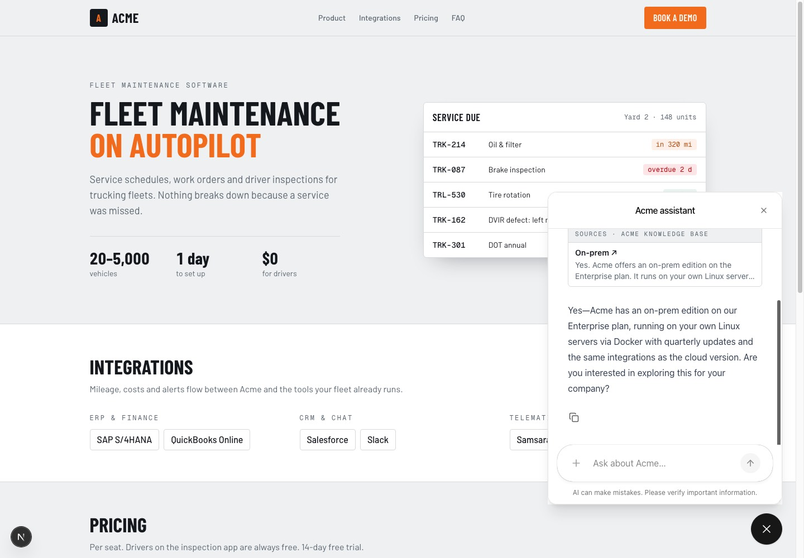

**Notes**

- The model rephrases the question ("Do you offer on-prem deployment?"); the task title uses its wording.
- Trashed Wiki pages drop out of search immediately, so S9 can use a normal delete.

---

## S8 — playbook (Flow B) + agent drives the page (X1)

**Goal:** the company changes Concierge's tone and offer by editing one Wiki page (no code, visible after a refresh); the agent highlights the right plan on the website itself.

**Files**

| File | What |
|---|---|
| `lib/playbook.ts` | Reads Wiki → Home → **Concierge playbook** (`CONCIERGE_PLAYBOOK_PAGE_ID`) with Concierge's key, `cache: "no-store"`. Parses `## Tone` / `formal` **and** `Tone: casual` styles; `Offer: none` → `null`. On error falls back to formal/no offer. `greetingFor()` builds the welcome text without a model call |
| `app/page.tsx` | `await connection()` (Next 16: render per request) → `readPlaybook()` → passes `playbook` + `greeting` to the widget |
| `components/concierge/ConciergeWidget.tsx` | `useAgentContext` with the playbook; welcome text from `greeting` (memoized labels); X1 `highlight_plan` via `useFrontendTool` (scrolls to `#plan-{plan}`, sets `data-highlighted`) |
| `app/globals.css` | Highlight style: orange ring, lift, "Best fit for you" tag |
| `lib/agent.ts` | Playbook rule (tone, offer only if not null, rules) and Plans rule (search pricing → `highlight_plan` → one sentence). **`providerOptions.anthropic.disableParallelToolUse: true`** |

**Bug found and fixed:** Claude called `search_knowledge` (server) and `highlight_plan` (browser) in the same step. The browser tool ran, but the follow-up run failed with `AI_MissingToolResultsError: Tool result is missing for tool call …`, so the reply never came and the Next dev overlay showed "1 Issue". Disabling parallel tool use makes each step one tool; the rerun had 0 errors and a full reply.

**Check it**

- X1: ask `Which plan fits a team of 200 seats?` → page scrolls to Pricing, Growth highlighted.
- Flow B: in Ambiguous change the playbook to Tone `casual`, Offer `20% off all plans this week` → refresh the website → greeting changes → ask `Do you have any discounts right now?`. Restore the page afterwards (text in `scripts/seed/concierge-playbook.md`; S9 automates it).

**Result (2026-09-12, headless Chrome)**

| Check | Seen |
|---|---|
| X1 | Sources Pricing/Integrations/FAQ → "Highlighted **Growth** on the pricing section" → "The Growth plan fits a 200-seat team perfectly, as it's designed for 25–500 seats with priority support and SAP/Salesforce integrations included." Page scrolled, Growth card ringed with "BEST FIT FOR YOU" |
| Flow B before (formal, no offer) | Greeting "Welcome to Acme. How can I help you today?"; discounts → "At present, no discount or promotional offer is active. I would be pleased to share our standard pricing plans if that would be helpful to you." |
| Flow B after edit + refresh | Greeting "Hey! 20% off all plans this week. What are you looking for?"; discounts → "We sure do — 20% off all plans this week if you sign up now! 🎉 Want me to point you to the right plan for your team size?" |
| Restore | Playbook back to formal / none (stored now as editor JSON, same as a UI edit; parsed correctly) → greeting "Welcome to Acme. How can I help you today?" |
| `tsc`, `eslint` | Clean |

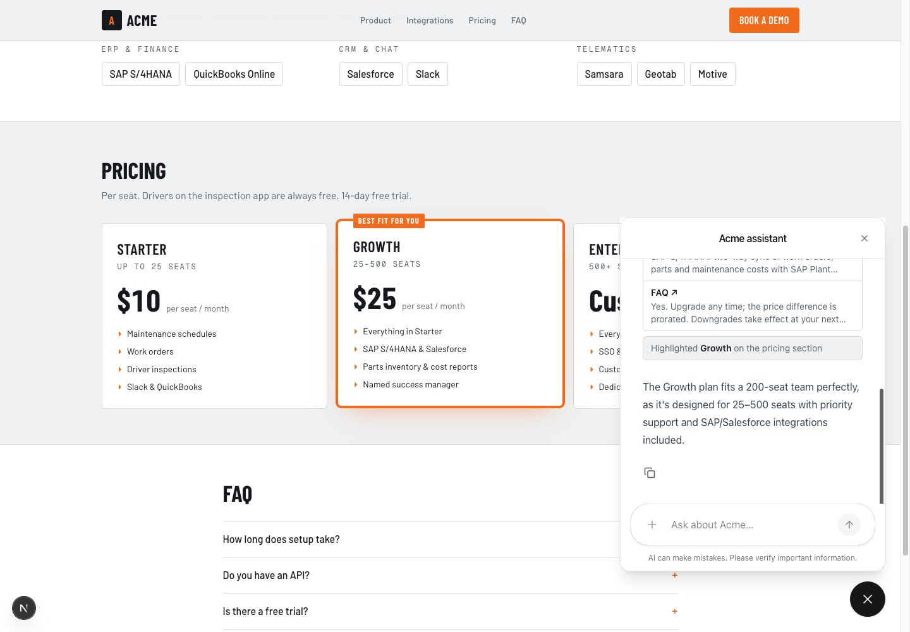


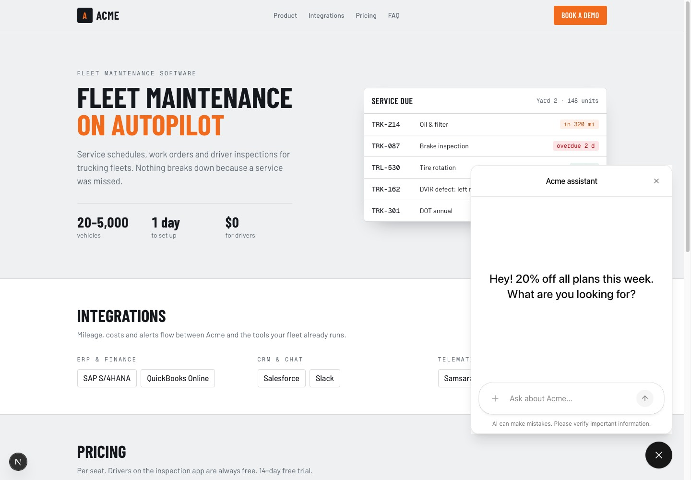

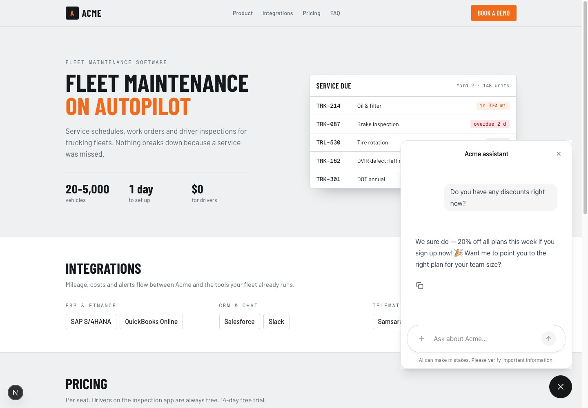

**Notes**

- Playbook edits apply on the **next page load** (by design, matches the demo script "judge edits → refresh").
- The playbook (tone, offer, rules) is sent to the browser as agent context, so a visitor could read it in dev tools. Fine for the demo; a production version would inject it server-side.
- **Feature-freeze check** ("A, E, B each twice from a fresh page load") runs in S9, right after the reset script exists, so the reruns don't pile up duplicate deals, bookings and tasks.
