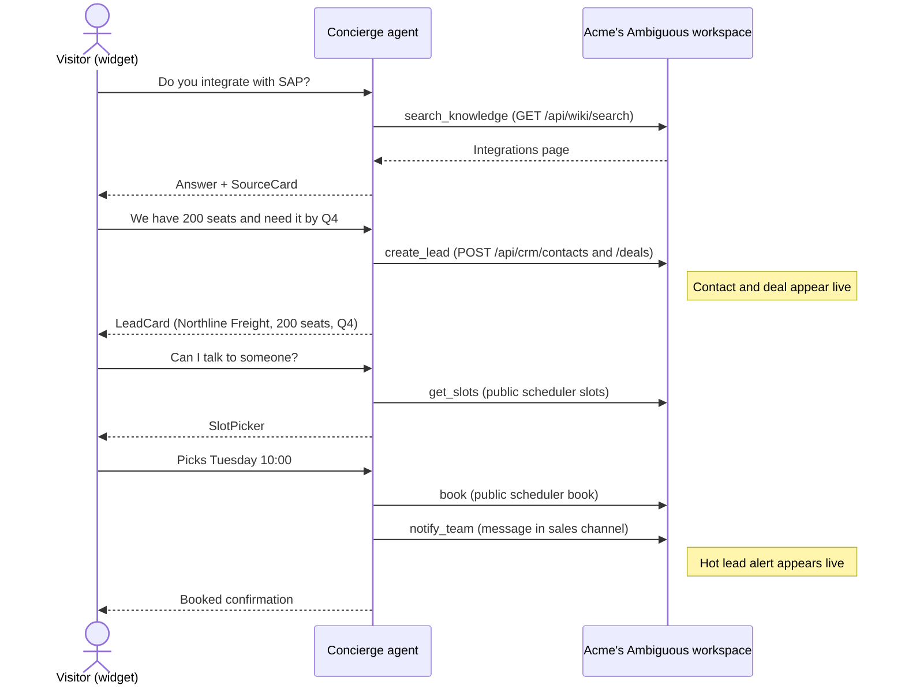
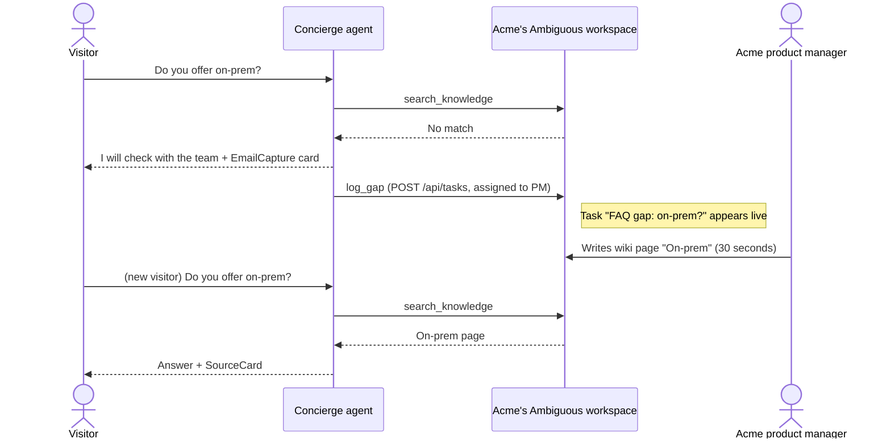
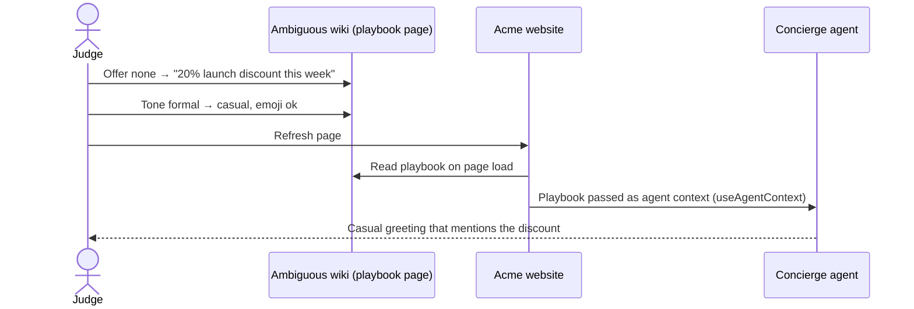
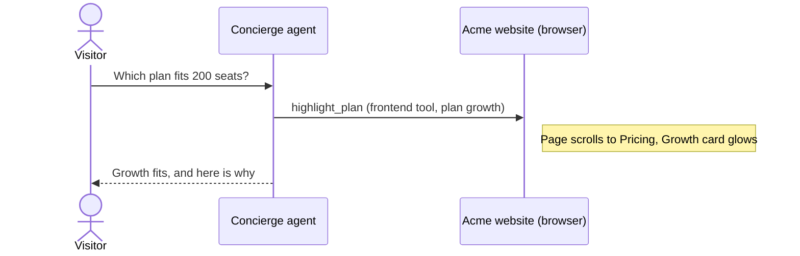

# Concierge — hackathon demo plan

What we build in ~3 hours, what we show, and what we cut. Companion to [`concierge-design.md`](concierge-design.md) (the full product design).

## TL;DR

- The **full design does not fit in 3 hours**. A scoped demo does: **3 core flows (A, E, B), one company, one workspace**, two people in parallel.
- **Wow factor = split screen.** Left: a fake client website with the Concierge chat widget. Right: the real Ambiguous app. Every visitor message causes a visible change on the right (CRM deal, sales alert, task, wiki page).
- **CopilotKit serves the client's customers** (website visitors). **The client's team works in Ambiguous.** We build nothing for the team.
- **Feature freeze at 2:10.** Last 30 minutes are rehearsal and a backup video.

## Who is who

```
Ambiguous             the platform. Not a party in any demo flow.
   └─ Acme            Ambiguous' client (B2B company). Owns the Ambiguous workspace.
        └─ Visitor    Acme's potential customer. Chats in the widget on Acme's website.
```

| Role | Example | Uses | In the demo |
|---|---|---|---|
| Platform | Ambiguous | — | Workspace + API underneath; never appears as a user |
| Ambiguous' client | Acme (placeholder name) | Ambiguous apps: Wiki, CRM, Chat, Tasks | Right screen: receives deals, alerts, tasks; edits the playbook |
| Client's customer | A lead from "Northline Freight" | CopilotKit widget on Acme's website | Left screen: asks questions, books a meeting |

- **CopilotKit** covers web (React, Angular, Vue) and mobile (React Native) interactions with the client's customers.
- **Not CopilotKit:** email replies (Ambiguous Mail), Slack/Teams (CopilotKit's paid Intelligence Channels — out of scope).
- The client's team would only need CopilotKit if we built a staff console (e.g. live conversation takeover). Out of scope for 3 hours.

## The demo stage

### Left screen — Acme's website (we build this)

A small **Next.js app** on `localhost:3000`. Not a plain static site: the CopilotKit runtime route (`/api/copilotkit`) must run server-side to hold the Claude and Ambiguous keys. One app serves both the website and the runtime.

```
┌──────────────────────────────────────────────────────┐
│ ACME  (logo)          Product  Integrations  Pricing │
├──────────────────────────────────────────────────────┤
│  HERO: "Fleet maintenance on autopilot"     [Demo]   │
├──────────────────────────────────────────────────────┤
│  INTEGRATIONS   SAP · Salesforce · Slack             │ ← Flow A: "Do you integrate with SAP?"
├──────────────────────────────────────────────────────┤
│  PRICING   Starter     Growth ★      Enterprise      │ ← Extra X1: agent scrolls here and
│            $10/seat    $25/seat      Custom          │   highlights the right plan
├──────────────────────────────────────────────────────┤
│  FAQ  (deliberately no on-prem answer)               │ ← Flow E: knowledge gap
└──────────────────────────────────────────┬───────────┘
                                           │ Concierge    │ ← CopilotKit popup, bottom right
                                           │ "Hi! 20% off │   greeting comes from the playbook
                                           │  this week"  │   (Flow B)
                                           └──────────────┘
```

- One page of marketing content (prices above are example values). Claude Code can generate it in ~20 minutes.
- Every section exists to give a flow something to point at.
- The **chat's knowledge** (answers, cards, slots) comes from the Ambiguous Wiki, not from the page. The page is the stage.

### Right screen — the real Ambiguous app (we build nothing)

- A second browser window on `https://app.ambiguous.ai`, placed side by side with the website.
- Use two windows, not an iframe: many apps block embedding, and we have not checked whether Ambiguous does. Two windows cannot fail.
- Tabs to keep open:

| Tab | What appears during the demo |
|---|---|
| CRM | New contact and deal (Flow A) |
| Sales chat channel | "Hot lead" alert (Flow A) |
| Tasks | "FAQ gap: on-prem?" task (Flow E) |
| Wiki | Playbook edit (Flow B), new "On-prem" page (Flow E) |

## The flows

| Flow | Story | Wow | Build time | Status |
|---|---|---|---|---|
| **A** | Visitor → qualified lead → booked meeting | CRM deal + meeting + sales alert in ~90 s, no human | ~80 min | **Core** |
| **E** | Agent detects a knowledge gap → PM fills it live | Company knowledge improves during the demo | ~15 min | **Core** |
| **B** | Judge edits the playbook wiki page → agent changes | Judge participation; "adapts per client" without code | ~15 min | **Core** |
| X1 | Agent drives the page: scrolls to pricing, highlights a plan | Agent works *inside* the client's site, not just in a chat box | ~15 min | **Best extra** (browser-only, no Ambiguous risk) |
| X2 | Page-aware opener | Greeting matches the section the visitor is reading | ~10 min | Cheap extra |
| C | Logged-in customer asks about an order | Shows the B2C use case | +35 min | Stretch |
| D | Sales rep replies in Ambiguous Chat → reply appears in widget | Human takeover | +50 min | Stretch, risky |

### Flow A — visitor to booked meeting

For **Acme's customer** (the visitor). Acme's sales team receives the results in Ambiguous.



**Tools:** `search_knowledge`, `create_lead`, `get_slots`, `book`, `notify_team`
**Generative UI:** SourceCard, LeadCard, SlotPicker
**Risk:** the public scheduler endpoints are untested. Fallback below.

### Flow E — the agent finds what the company doesn't know



**Extra work over Flow A:** one tool (`log_gap`) and one card. Search is already built.

### Flow B — the company reprograms the agent without code



**How:** the page reads the playbook wiki page on load and hands it to the agent with `useAgentContext`. No multi-tenancy needed.

### Extra X1 — agent drives the page



**How:** `useFrontendTool` registered on the website page; the handler scrolls to the pricing section and adds a highlight class. No Ambiguous call, so untested endpoints cannot break it.
**Skip when:** the website has no pricing section; use X2 instead.

### Extra X2 — page-aware opener

`useAgentContext` sends the section currently in view (e.g. `pricing`). Visitor opens the chat while on Pricing → "Comparing plans? Tell me your team size."

### Flow C — order status (stretch)

A hardcoded "logged-in" demo customer asks "Where is my order?" → agent reads an orders Sheet → **OrderCard** (status, tracking) → "Change my address" → confirmation card (`useHumanInTheLoop`) → Task for Acme's ops team.

### Flow D — human takeover (stretch, risky)

Acme's sales rep replies in Ambiguous Chat → reply shows up in the widget. Needs a webhook reachable from the internet (tunnel) or polling. Only attempt if everything else is done early.

## Interaction types (CopilotKit v2 hooks)

All hooks import from `@copilotkit/react-core/v2`. Details: [`../copilotkit/copilotkit-context.md`](../copilotkit/copilotkit-context.md) §7.

| Hook | Interaction type | Example |
|---|---|---|
| `useRenderTool` | Agent shows a result as a card | SourceCard, LeadCard, OrderCard |
| `useHumanInTheLoop` | Visitor chooses or confirms | SlotPicker, "confirm address change" |
| `useFrontendTool` | Agent acts on the website itself | Scroll to pricing and highlight a plan |
| `useAgentContext` | Agent knows where the visitor is and what the playbook says | Pricing section in view → "Comparing plans?" |
| `useAgent` (shared state) | A panel updates live during the chat | Lead profile fills in as the visitor talks |
| `useComponent` | Display-only generated UI | Comparison table, intake form |

### Interaction catalog

| Interaction | Hook | Ambiguous data | Build time | Status |
|---|---|---|---|---|
| Answer + source card | `useRenderTool` | Wiki search | part of Flow A | Core (A) |
| Lead card | `useRenderTool` | CRM contact + deal | part of Flow A | Core (A) |
| Slot picker → booking | `useHumanInTheLoop` | Scheduler, Task fallback | 30 min | Core (A) |
| Email capture on a knowledge gap | `useHumanInTheLoop` | Task | part of Flow E | Core (E) |
| Playbook-driven greeting | `useAgentContext` | Wiki playbook | part of Flow B | Core (B) |
| Agent drives the page | `useFrontendTool` | none | ~15 min | Best extra (X1) |
| Page-aware opener | `useAgentContext` | none | ~10 min | Cheap extra (X2) |
| Live lead profile panel | `useAgent` state | CRM | ~25 min | Stretch |
| Order card + address change | `useRenderTool` + `useHumanInTheLoop` | Sheet + Task | +35 min | Stretch (C) |
| Quote builder → send for signature | `useHumanInTheLoop` | Sign | 45+ min | Does not fit |
| Intake form generated in chat (RFQ, returns) | `useComponent` | Forms | 30+ min | Does not fit |

## 3-minute demo script

| Time | Flow | What the audience sees |
|---|---|---|
| 0:00–1:15 | A | Visitor asks, gets a sourced answer, becomes a CRM deal, books a meeting; sales alert pops up on the right |
| 1:15–2:15 | E | Agent can't answer, creates a task; PM writes the wiki page; next visitor gets the answer |
| 2:15–2:45 | B | A judge edits the playbook; refresh; agent's tone and offer change |
| 2:45–3:00 | Close | "Every Ambiguous client gets a website agent that works on its own workspace data. Routine calls cost them zero AI actions." |

If X1 is built, fold it into Flow A right after the SAP answer ("Which plan fits 200 seats?"), ~15 s.

The closing claim comes from Ambiguous pricing: external agents' routine CRUD does not consume AI actions. Drop it if the demo uses premium operations (image generation, web search).

## Is it doable in 3 hours?

| Piece | Estimate | Risk |
|---|---|---|
| Setup: Ambiguous workspace + API key, CopilotKit v2 Next.js app with Claude | 25 min | Medium (first time on v2) |
| Seed data: wiki pages, playbook page, CRM, sales channel (via Ambiguous CLI) | 20 min | Low |
| Flow A without booking: 3 tools + SourceCard + LeadCard | 50 min | Medium |
| Booking: SlotPicker + scheduler endpoints | 30 min | **High** (endpoint untested) |
| Flow E | 15 min | Low |
| Flow B | 15 min | Low |
| Acme website page | 20 min | Low |
| Rehearsal + backup video | 30 min | Mandatory |
| **Total (two people in parallel)** | **≈ 2 h 50 min** | Tight but doable |
| X1 / X2 | +15 min / +10 min | Only with freed time |
| Flow C / Flow D | +35 min / +50 min | Does not fit |

## What we cut from the full design

| Cut | Demo replacement | Time saved |
|---|---|---|
| `<script>` widget embedded on real client sites, CORS | Next.js page styled as Acme's website, with `CopilotPopup` | ~50 min |
| Multi-tenant, per-client API keys, provisioning | One workspace, one `ak_` key in `.env.local` | ~40 min |
| Visitor verification tiers | Anonymous-visitor flows only | ~30 min |
| One agent instance per request | Single agent instance (one demo visitor at a time) | ~15 min |
| Webhooks and two-way human handoff | One-way message to the sales channel | ~50 min |
| Staff console for the client's team | The team uses Ambiguous' own apps | — |

## Who does what

```mermaid
gantt
    title 3-hour plan
    dateFormat HH:mm
    axisFormat %H:%M
    section Person 1 (agent + Ambiguous)
    Workspace + key + CopilotKit runtime       :p1a, 00:00, 30m
    Tools search_knowledge + create_lead + notify_team :p1b, after p1a, 50m
    Scheduler check (fallback ready) + log_gap :p1c, after p1b, 50m
    Bug fixes                                  :p1d, after p1c, 20m
    section Person 2 (UI + demo)
    Seed wiki + playbook + CRM + sales channel :p2a, 00:00, 30m
    Acme website + SourceCard + LeadCard       :p2b, after p2a, 50m
    SlotPicker + gap card + playbook context   :p2c, after p2b, 50m
    Split-screen layout + pitch                :p2d, after p2c, 20m
    section Both
    Rehearse twice + backup video + submit     :b1, 02:30, 30m
```



| Clock | Person 1 — agent + Ambiguous | Person 2 — UI + demo |
|---|---|---|
| 0:00 | Workspace, `ak_` key, CopilotKit runtime | Seed wiki, playbook, CRM, sales channel via CLI |
| **0:30** | **Checkpoint:** chat replies; `whoami` OK | |
| 0:30 | Tools: `search_knowledge`, `create_lead`, `notify_team` | Acme website + popup, SourceCard, LeadCard |
| **1:20** | **Checkpoint:** Flow A (without booking) works end to end | |
| 1:20 | Scheduler endpoints (20-min timebox), `log_gap` tool | SlotPicker, gap card, playbook via `useAgentContext` |
| **2:10** | **Checkpoint:** A + E + B work → **feature freeze** | |
| 2:10 | Bug fixes | Split-screen layout, pitch text |
| 2:30 | Rehearse twice, record backup video, submit | |

## Fallback rules

| Trigger | Action |
|---|---|
| Scheduler endpoint not working by **1:40** | SlotPicker shows fixed slots; booking creates a Task "Call Northline Freight Tue 10:00". Demo looks identical. Use the ~20 freed minutes for X1. |
| CopilotKit not streaming by **0:45** | Cut Flow B and the gap card; demo Flow A only. |
| Anything broken at **2:10** | Stop building. Demo what works; use the backup video for the rest. |

## Decide before starting

1. **Demo company.** Suggested: Acme = fleet maintenance software for trucking companies. B2B, a plausible SAP integration, per-seat pricing that fits "200 seats", and "on-prem?" is a realistic gap question. The website and the seeded Wiki must tell the same story.
2. **Model:** Claude via CopilotKit `BuiltInAgent` (confirm the model specifier; see design doc §8).
3. **Who is Person 1 and Person 2.**
4. **Credentials in place** before 0:00 — see [`../README.md`](../README.md) "Team setup".
